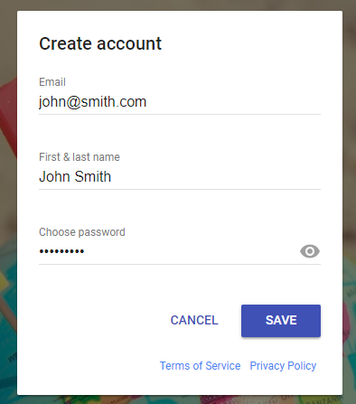

# FindU
## Welcome To The Readme For FindU, a site that will change the way you meet up with friends!

#The Vision of FindU
We created FindU with the hopes to make locating and hanging out with friends simpler and accessible to all. Whether you just want to see where someone is at, to contacting them to go out for lunch, FindU is the solution to these common, everyday problems. FindU is a work of passion and is still in development!

### Starting step
When the pages loads up, you will be greeted with a screen to sign in. You can either sign up with a gmail account, or create a new account using email and password.

### Signing up
Signing up couldn't be easier! Just enter an email and the sign in/up process will begin! If you already have an account, you will then be prompted to enter your password. If you do not have an account yet, don't worry! Creating one is super simple!

### Create you Display Name
Once an email has been entered, if you are creating an account for the first time you will be asked to create a display name. Preferablly this would be your actual name so others know who you are! You will then create a password as well!

# Getting Your Location
This part is very important. Be sure once the popup deploys asking for your location to click allow. This will simply grab your current location so others can see you on the map. Without giving permission, no one will be able to see you!

### Here's our map
Once the page has permission to grab your location, our mapbox map will load with you and other users on the map! Your marker/current position is marked by the red marker, while other users are the blue ones. So see a users name, simply click on their marker and their display name will popup!

### Zooming feature
To zoom in and out on the map we have enabled the zoom tool on the side of the map. If you are mobile you can use your fingers to zoom in and out as well.

### User ID
After clicking on someones marker, their display name will appear like this.

### Who's online
Right here is our coolest feature right now. We take user info from our database and list all the current users who are online. As of right now (11/29/2018) it will show everyone who is online. We will add a freinds list to filter down who you want to see in the near future.

### Logout
When you no longer need to use the map, just press logout and your display name will be taken off the Who's Online list.

### Future Plans
FindU is a work in progress. We intend to continue development on it to create a something amazing one day. We hope to one day come up with a better name, aswell as add friends list and friending system and a active chat system. 

## Thank You For Checking Out FindU!

