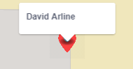

# FindU
## This is our read me for our group project FindU 

### Starting step

Here is where you start. You either use your Gmail account or any other e-mail.

### Signing up

Here is where you sign in. Don't worry if you haven't made an account yet. Our database will see if you havent made on yet.

### Create you Display Name

Here you'll type in you're disired display name and password. NOTE: As of right now (11/29/2018), we don't have a way to recover passwords. Please write down your password.

# !!!YOU NEED TO HIT ALLOW FOR THE MAP TO WORK!!!

### Here's our map

Here is where we load in our map. As of right now we have mapbox generate A marker for other users. The current user marker is the red one. You'll be able to center on yourself with just a mouse click.

### Zooming feature

This is the mapbox element that allows us to zoom in and out of the map

### User ID

Here is our mapbox popup. We have it set up to display over everyones marker with their chosen display name.

### Who's online

Right here is our coolest feature right now. We take user info from our database and list all the current users who are online. As of right now (11/29/2018) it will show everyone who is online. We will add a freinds list to filter down who you want to see in the near future.

### Logout

When you no longer need to use the map, just press logout and your display name will be taken off the Who's Online list.

